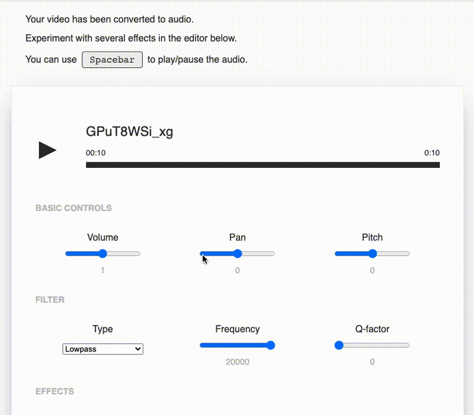

# dionysus

> University project for FEUP, MIEIC (MNSE).

An audio playground for YouTube videos.

## Usage

You will need [Node.js](https://nodejs.org/en/) and [ffmpeg](https://www.ffmpeg.org/) on your machine.

Fetch the dependencies with `npm i` and start the development server with `npm start`.

The server will host the project locally on port `3000`.

### Warning

This project relies on [`youtube-dl`](https://github.com/przemyslawpluta/node-youtube-dl) which may occasionally stop working due to YouTube changing the way their videos can be downloaded. 

If this project ever stops working, run `npm run update` to check for and download any new updates to the `youtube-dl` binary. 
